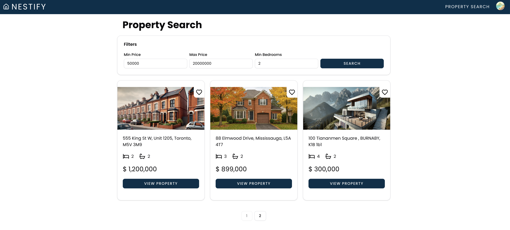
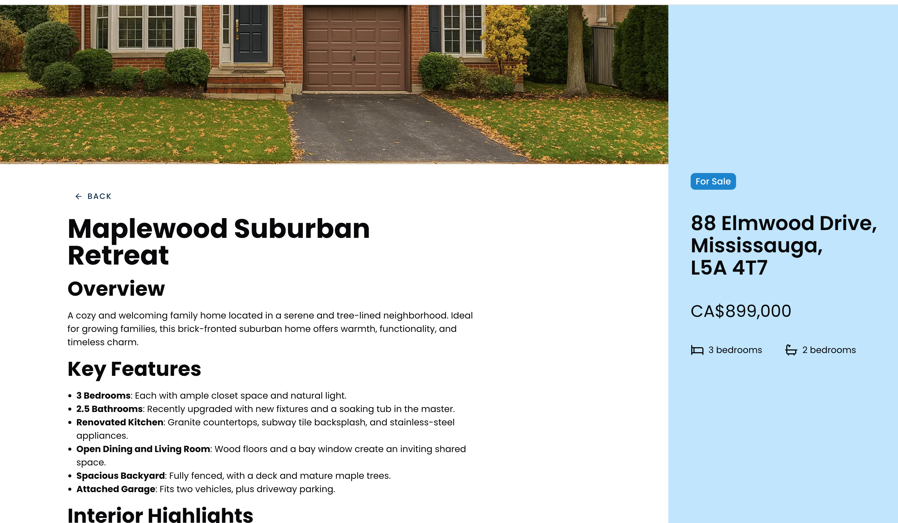
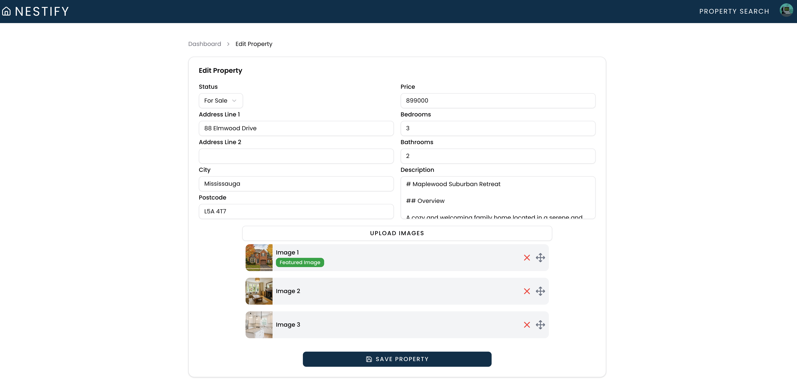

# 🏡 Nestify – Full-Stack Real Estate Web App

Nestify is a full-stack, production-ready real estate web application built with **Next.js** and **Firebase**. It allows users to explore and favorite listings, while giving admin users a seamless dashboard to manage properties — including dynamic forms, multi-image uploads, and rich markdown-based descriptions.

Designed with a modern UI system, secure authentication, and a clear separation of client and server responsibilities, Nestify delivers a clean, scalable architecture and smooth user experience. It features robust role-based access control to ensure users and admins have the appropriate permissions across the app.

---

### 🖼 Preview

**🔍 Property Search with Favorites**
> Users can search and filter listings, and save favorites after logging in.



**🏡 Property Display**
> Modern, mobile-responsive listing page with full markdown description and image gallery.



**🛠 Admin Dashboard**
> Admins can add and update properties through an intuitive dashboard.



---

## 🚀 Features

- 🔐 **Authentication & Authorization**
  - Google Sign-In using Firebase Auth
  - Role-based access (user/admin) with secure cookie storage
  - Route protection via Next.js middleware

- 🏘 **Property Management**
  - Admins can create and update properties
  - Dynamic form with Zod validation + multi-image uploads
  - Markdown descriptions rendered on property pages

- 🔍 **Property Search & Filters**
  - Filter by price and bedrooms
  - Pagination and filter state managed via URL params

- 🖼 **Favorites & User Interaction**
  - Users can save properties to favorites
  - Toggle button state is dynamic and persisted

---

## 🔧 Project Structure
/app – Next.js App Router pages, including server/client components and route handling  
/components – Reusable UI components, form inputs, layouts, and custom widgets  
/context – React context providers for state management (e.g., Firebase auth)  
/data – Server-side Firestore queries and utilities (e.g., getProperties)  
/firebase – Firebase initialization and configuration (client/server separated)  
/lib – Utility functions (e.g., image URL formatter, pagination helpers)  
/validation – Zod schema definitions for form validation and typing  

## 🛠 Setup Instructions

1. **Clone the repo**
   ```bash
   git clone https://github.com/your-username/nestify.git
   cd nestify
   ```

2. **Install dependencies**
   ```bash
   npm install
   ```

3. **Set up Firebase**
   - Create a Firebase project
   - Enable Authentication (Google Sign-In)
   - Set up Firestore and Storage
   - Copy your Firebase credentials to a `.env.local` file:
     ```
     NEXT_PUBLIC_FIREBASE_API_KEY=your_key
     NEXT_PUBLIC_FIREBASE_AUTH_DOMAIN=your_project.firebaseapp.com
     NEXT_PUBLIC_FIREBASE_PROJECT_ID=your_project_id
     NEXT_PUBLIC_FIREBASE_STORAGE_BUCKET=your_project.appspot.com
     ```

4. **Run the app locally**
   ```bash
   npm run dev
   ```

---

📬 **Contact**

Created with 💻 by **Jin Zhang**  
For questions, collaboration, or freelance inquiries, feel free to reach out on [LinkedIn](https://www.linkedin.com/in/jinzhang-hoyas/) or open an issue in the repo.

---

📄 **License**

This project is licensed under the [MIT License](LICENSE).

---

## 🚧 Next Steps

- 📱 Improve mobile responsiveness and UX
- 🤖 Integrate AI-powered chatbot for guided search and inquiries
- 💬 Enable user reviews and messaging
- 🗂 Expand admin features (analytics, batch upload, etc.)